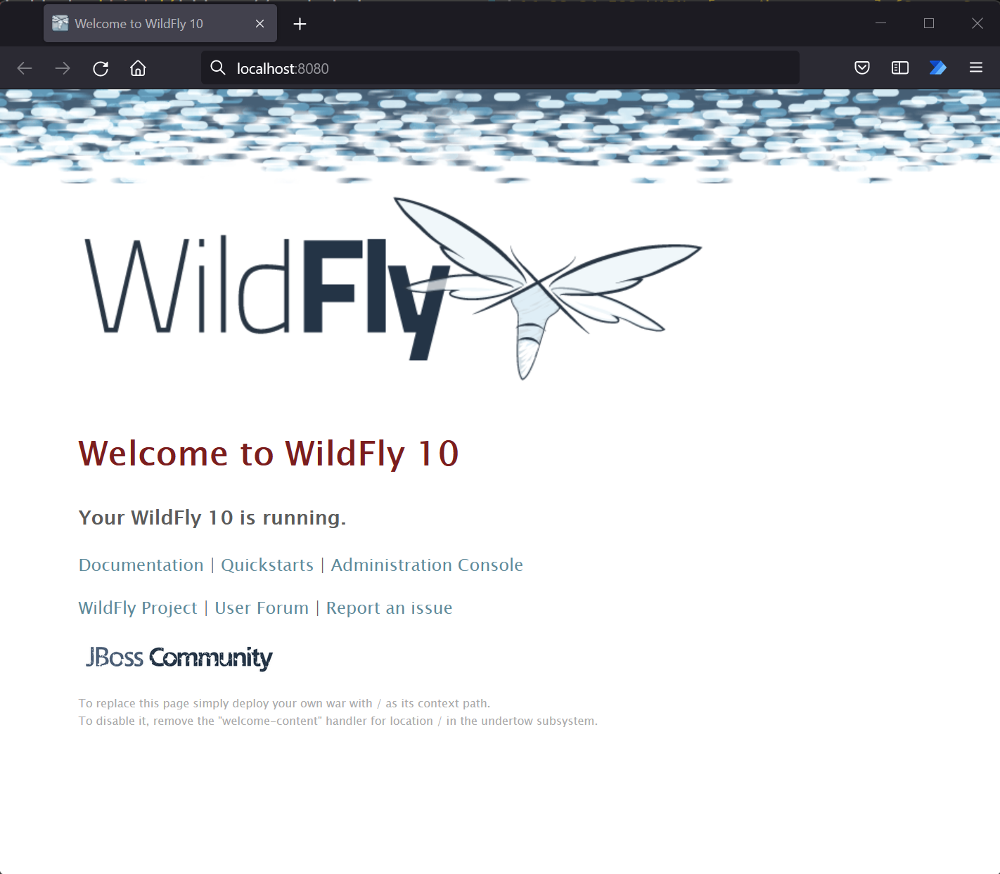
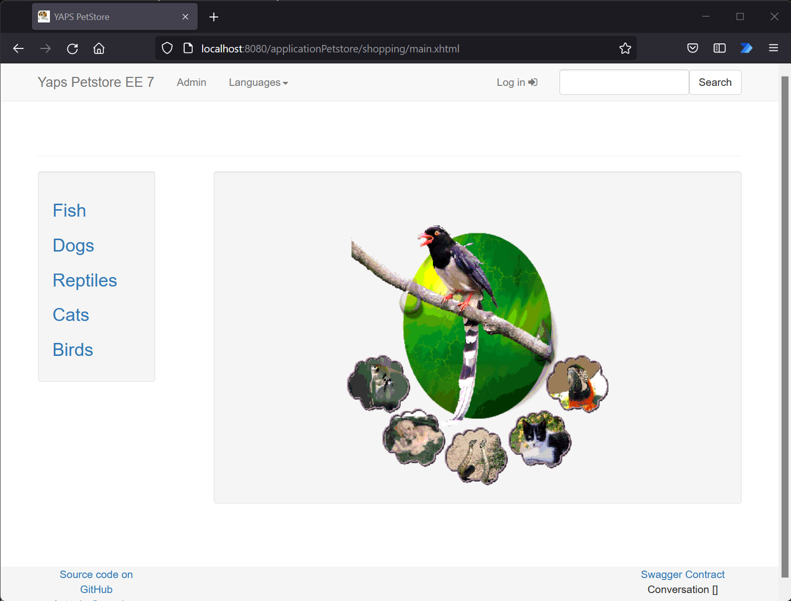
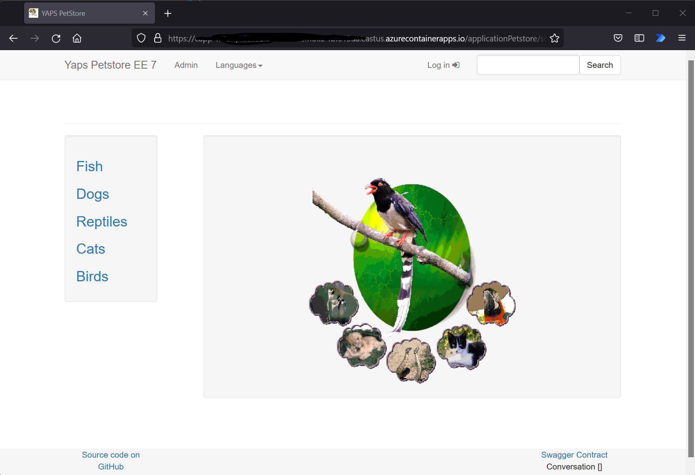

# How to containerize Java applications running on WildFly and deploy to Azure?

This repository will detail steps to containerize Java application running on WildFly application server and running them in Azure App Service and Azure Container Apps.

In this tutorial, WildFly 10.1.0 version is being used. However, any version that is downloadable from [WildFly site](https://www.wildfly.org/downloads/) can be used. If you are changing the version, you may have to change the download URL in the WildFly-Base/Dockerfile.

## Pre-requisites

All commands are run in a bash shell for this tutorial.

These steps below assume the following:

1. Azure Subscription is setup.

1. [Azure Container Registry is created](https://docs.microsoft.com/en-us/azure/container-registry/container-registry-get-started-portal)

1. [Docker](https://docs.docker.com/get-started/#setup) is setup and verify by running the command below.

    ```bash
    docker --version
    ```

1. Clone this repository by running the commands below.

    ```bash
    git clone https://github.com/fsaleemm/JavaWildFlyContainers.git
    cd JavaWildFlyContainers
    ```

## Build and Test Base Image Running WildFly Locally

### Build the WildFly-Base image

```bash
cd WildFly-Base
docker build -t wildfly-base .
```

### Run the container locally with WildFly-Base image

```bash
docker run -p 8080:8080 wildfly-base
```

Launch browser and navigate to http://localhost:8080. You should get the below screen.



Stop the container by typing Ctrl+c.

## Build and Test Application Image using Base WildFly Image Locally

### Build the Petstore Application

The Petstore application source code is in this [repository](https://github.com/agoncal/agoncal-application-petstore-ee7).

To build the application package use maven.

```bash
git clone https://github.com/agoncal/agoncal-application-petstore-ee7.git
cd agoncal-application-petstore-ee7
mvn clean install -DskipTests
```

Copy the "war" file in the agoncal-application-petstore-ee7/target directory to WildFly-App directory.

Alternatively, you can use the applicationPetstore.war already in the WildFly-App directory.

### Build the WildFly-App image

```bash
cd ../WildFly-App
docker build -t <Your-Azure-Container-Registry-Name>.azurecr.io/wildfly-app .
```

### Run the container locally with WildFly-App image

```bash
docker run -p 8080:8080 <Your-Azure-Container-Registry-Name>.azurecr.io/wildfly-app
```

Launch browser and navigate to http://localhost:8080/applicationPetstore/. You should see the application screen below.



Stop the container by typing Ctrl+c.

## Push Image to Azure Container Registry

Login to your Azure Container Registry

```bash
az acr login -n <Your-Azure-Container-Registry-Name>
```

Publish the docker image to your registry

```bash
docker push <Your-Azure-Container-Registry-Name>.azurecr.io/wildfly-app
```

## Create Resource group

```bash
az login

RESOURCE_GROUP="<Your-Resource-Group>"
LOCATION="<Your-preferred-location>"

az group create --name $RESOURCE_GROUP --location $LOCATION
```

## Deploy to Azure App Service

Create App, set the configuration setting, enable managed identity, give managed identity access to ACR, and deploy image from ACR.

```bash
ASP_NAME="<Your-App-Service-Plan-Name>"
APP_NAME="<Your-App-Name>"
REGISTRY_NAME="<Your-Azure-Container-Registry-Name>"
ACR_RESOURCE_GROUP="<Resource Group for Azure Container Registry>" # Allowing for ACR in different RG

# Create App Service Plan
az appservice plan create --name $ASP_NAME --resource-group $RESOURCE_GROUP --is-linux

# Create App
az webapp create --resource-group $RESOURCE_GROUP --plan $ASP_NAME --name $APP_NAME --deployment-container-image-name <Your-Azure-Container-Registry-Name>.azurecr.io/wildfly-app:latest

# Set port as container exposes port 8080. The App Service request port will always be 443 (https)
az webapp config appsettings set --resource-group $RESOURCE_GROUP --name $APP_NAME --settings WEBSITES_PORT=8080

# Enable Managed Identity on App Service
APP_SERVICE_PRINCIPAL=$(az webapp identity assign --resource-group $RESOURCE_GROUP --name $APP_NAME --query principalId --output tsv)

# Get subscription Id
SUBSCRIPTION_ID=$(az account show --query id --output tsv)

# Assign AcrPull role for App Service on Container Registry
az role assignment create --assignee $APP_SERVICE_PRINCIPAL --scope /subscriptions/$SUBSCRIPTION_ID/resourceGroups/$ACR_RESOURCE_GROUP/providers/Microsoft.ContainerRegistry/registries/$REGISTRY_NAME --role "AcrPull"

# Set App Service to use Managed Identity for ACR
az resource update --ids /subscriptions/$SUBSCRIPTION_ID/resourceGroups/$RESOURCE_GROUP/providers/Microsoft.Web/sites/$APP_NAME/config/web --set properties.acrUseManagedIdentityCreds=True

```

Launch browser and navigate to https://\<Your-App-Name\>.azurewebsites.net/applicationPetstore. You should see the application below:


## Deploy to Azure Container Apps (In Preview)

NOTE: The steps below are based on the preview version of [Azure Container Apps](https://docs.microsoft.com/en-us/azure/container-apps/overview). The steps may change for the GA version.

In preview version, there is no ACR integration using Managed Identities, so ACR needs to have Admin user enabled.

1. Run through these [Setup](https://docs.microsoft.com/en-us/azure/container-apps/get-started-existing-container-image?tabs=bash&pivots=container-apps-private-registry#setup) steps.

1. Run through these [Create an environment](https://docs.microsoft.com/en-us/azure/container-apps/get-started-existing-container-image?tabs=bash&pivots=container-apps-private-registry#create-an-environment) steps.

1. Create Container App following below steps:

    ```bash
    RESOURCE_GROUP="<Your-Resource-Group>"
    CONTAINERAPPS_ENVIRONMENT="<Your-Container-Apps-Environment-Name>"
    CONTAINERAPPS_Name="<Your-Container-Apps-Name>"
    CONTAINER_IMAGE_NAME="<Your-Azure-Container-Registry-Name>.azurecr.io/wildfly-app:latest"
    REGISTRY_LOGIN_SERVER="<Your-Azure-Container-Registry-Name>.azurecr.io"
    REGISTRY_USERNAME="<Your-ACR-Username>"
    REGISTRY_PASSWORD="<Your-ACR-Password>"
    
    # Create the Container App
    az containerapp create \
    --name $CONTAINERAPPS_Name \
    --resource-group $RESOURCE_GROUP \
    --environment $CONTAINERAPPS_ENVIRONMENT \
    --image $CONTAINER_IMAGE_NAME \
    --registry-login-server $REGISTRY_LOGIN_SERVER \
    --registry-username $REGISTRY_USERNAME \
    --registry-password $REGISTRY_PASSWORD \
    --target-port 8080 \
    --ingress 'external' \
    --query configuration.ingress.fqdn
    
    ```

The output of the create container app command will provide the URL of the application.

Launch browser and navigate to https://\<URL-FROM-CREATE-CONTAINER-APP-OUTPUT\>/applicationPetstore. You should see the below screen:



## References

[Migrate custom software to Azure App Service using a custom container](https://docs.microsoft.com/en-us/azure/app-service/tutorial-custom-container?pivots=container-linux)

[Container Apps QuickStart: Deploy an existing container image with the Azure CLI](https://docs.microsoft.com/en-us/azure/container-apps/get-started-existing-container-image?tabs=bash&pivots=container-apps-private-registry)

[Run a custom container in Azure App Service](https://docs.microsoft.com/en-us/azure/app-service/quickstart-custom-container?tabs=dotnet&pivots=container-linux)

[Application - Petstore Source Code](https://github.com/agoncal/agoncal-application-petstore-ee7)

[WildFly Docker Images](https://github.com/jboss-dockerfiles/wildfly)

[Azure-Samples - app-service-wildfly](https://github.com/Azure-Samples/app-service-wildfly)

[WildFly downloads](https://www.wildfly.org/downloads/)

## Disclaimer

This is an example intended for illustration purposes and is not production ready code.
